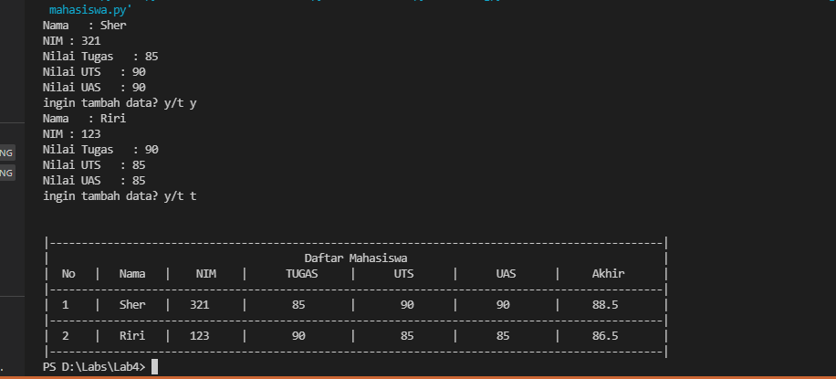

# Lab4
## Latihan List

### Fungsi Fungsi Command di List
#### Ini adalah bentuk fungsi-fungsi dari list
#### Berikut bentuk code seperti di gambar

##### Menggunakan kode .append fungsinya untuk menambahkan satu item ke elemen terakhir
##### Menggunakan kode .extend fungsinya untuk menambahkan beberapa item ke elemen terakhir

#### Berikut hasil output dari program

## Tugas Praktikum 4
### Program Input Data mahasiswa
### Penjelasan Program
Program ini adalah proses menginput data mahasiswa menggunakan fungsi List di program dan menghitung nilai akhirnya dan menggunakan fungsi pengulangan y/t(Ya dan Tidak) lebih lagi bisa di liat di keterangan di dalam program
#### Cara kerja program
Input Nama, Nim, Nilai Tugas, UAS, UTS Dan program akan menghitung Nilai Akhir dan memunculkan bentuk List
#### Berikut Bentuk Flowchartnya

#### Berikut Bentuk Programnya dan ada beberapa keterangan di program

#### Berikut Bentuk Hasil dari Program
